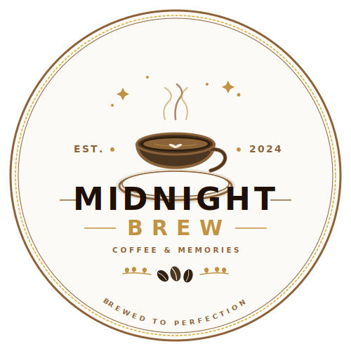

# ☕ Midnight Brew — Fine Coffee & Memories

<p align="center">
  
</p>

<p align="center">
  <strong>An elegant, premium café & roastery web application featuring an immersive user interface, dynamic multi-currency menu, custom beverage crafter, and smart reservation system.</strong>
</p>

<p align="center">
  
  
  
  
  
</p>

---

## ✨ Features & Functionality

Midnight Brew is a luxury café website designed with high aesthetic standards, featuring seamless interactions and real-time state management.

### 🌟 1. Artisanal Drink Customizer
An interactive beverage crafting station:
- **Base selection**: Choose between Signature Espresso, Slow-Cold Brew, Organic Matcha, and Belgian Cocoa.
- **Custom Add-ins**: Toggle whole milk, oat milk, almond milk, and sweetness level.
- **Micro-animations**: Dynamic calorie calculation and custom item pricing.
- **Artisanal Toppings**: Add warm caramel drizzle, Belgian chocolate curls, organic whipped cream, or Ceylon cinnamon dust.

### 💵 2. Dual-Currency Engine (INR / USD Toggle)
The entire website dynamically translates between **Indian Rupee (₹)** and **US Dollars ($)** instantly:
- Dynamic pricing logic integrated into both the standard menu and the interactive customizer.
- Currency choice persists throughout ordering checkout and price tags.

### 📅 3. Interactive Table Booking
A complete, custom-styled table reservation wizard:
- Select guests, select date, and select time slot.
- **Interactive Map**: Live selection of table location (Cozy Window Side, Premium Oak Booth, Quiet Study Nook, Bar Counter).
- Fully validated client-side reservation state and automatic seat assignment.

### 🍽️ 4. Curated Gourmet Menu & Filter Engine
Explore premium culinary and espresso blends:
- Filter menu by categories: *All, Hot Coffee, Cold Coffee, Other Beverages, Pastries, Specialty Desserts*.
- **Dietary Filter System**: Quickly find *Vegan*, *Gluten-Free*, or *Vegetarian* options.
- Dynamic search bar to lookup gourmet items in real-time.
- Highly detailed product expansion modal featuring ingredient lists, calorie counts, and pricing.

### ✍️ 5. Customer Review Loop
A community review board supporting real-time feedback:
- Leave custom-rated stars, names, and reviews.
- Auto-date stamping and verified purchase indicators.

---

## 📁 Repository Directory Structure

The project directory layout is highly modular and strictly typed, ensuring clean separation of concerns:

```text
midnight-brew/
├── public/
│   └── logo.svg                 # Brand-new circular vector logo
├── src/
│   ├── components/              # Modular UI Component Layer
│   │   ├── About.tsx            # Café history, philosophy, and heritage
│   │   ├── Contact.tsx          # Contact form, opening hours, & google maps hook
│   │   ├── Customizer.tsx       # Step-by-step beverage crafting simulator
│   │   ├── FAQ.tsx              # Interactive accordions for guest queries
│   │   ├── Footer.tsx           # Multi-column footer featuring the custom logo
│   │   ├── Gallery.tsx          # visual showcases of barista crafts
│   │   ├── Hero.tsx             # Immersive opening display with parallax typography
│   │   ├── Menu.tsx             # Filterable food/drink grid with modal details
│   │   ├── Navbar.tsx           # Floating responsive navbar with INR/USD toggler
│   │   ├── ReservationModal.tsx # Interactive seating planner & reservation wizard
│   │   ├── Reviews.tsx          # Rating submissions and social proof section
│   │   └── WhyChooseUs.tsx      # Core values and features highlighting
│   ├── App.tsx                  # Root state orchestration & layout structure
│   ├── data.ts                  # Raw menu databases, FAQ items, and reviews
│   ├── index.css                # Global styles, Google Fonts, & Tailwind themes
│   ├── main.tsx                 # Core React DOM entry-point
│   └── types.ts                 # Shared TypeScript interface declarations
├── index.html                   # HTML Entry template with logo favicon
├── metadata.json                # Project configurations & permissions
├── package.json                 # Dependency definitions & dev server scripts
├── tsconfig.json                # Strict TypeScript rules compiler options
└── vite.config.ts               # Vite configuration with Tailwind CSS plugin
```

---

## 🛠️ Quick Start Guide

Follow these steps to clone the repository, install dependencies, and run the development server locally.

### Prerequisites
Make sure you have [Node.js](https://nodejs.org/) (version 18 or above) and `npm` installed.

### 1. Clone the Repository
```bash
git clone https://github.com/your-username/midnight-brew.git
cd midnight-brew
```

### 2. Install Dependencies
```bash
npm install
```

### 3. Run the Development Server
```bash
npm run dev
```
The server will boot up and be accessible on `http://localhost:3000`.

### 4. Build for Production
To generate an optimized, light-weight build of static files in the `/dist` directory:
```bash
npm run build
```

---

## 🎨 Visual Identity & Typography

- **Colors**: Rich dark chocolate browns (`stone-900`, `amber-950`), glowing warm golden accents (`amber-400`, `amber-100`), and clean off-white backgrounds (`stone-50`, `amber-50`).
- **Typography**: 
  - Brand Titles: **Cinzel** & **Playfair Display** (for luxury, heritage, and vintage warmth)
  - Copy/Interface: **Inter** (for high legibility and contemporary crispness)
  - Numeric metrics: **JetBrains Mono** (for technical details, prices, and stats)

---

## 📜 License
This project is open-source and available under the [MIT License](LICENSE).

---
<p align="center">Designed with ♥ by <strong>Midnight Brew Café Team</strong></p>
